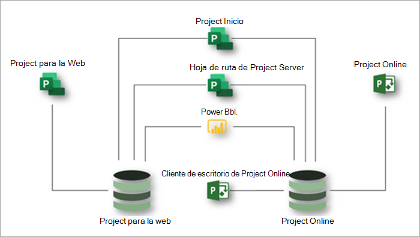

# Descripción del servicio de Microsoft ProjectMicrosoft Project service description

## Información generalOverview

Microsoft Project ofrece las siguientes aplicaciones para ayudarle a satisfacer las necesidades de su organización en cuanto a la administración de proyectos y trabajo:Microsoft Project offers the following applications to help meet your organization's needs for project and work management:

- Project para la webProject for the web
- Project OnlineProject Online 
- Cliente de escritorio de Project onlineProject Online desktop client

Este artículo le ayudará a comprender qué aplicaciones se proporcionan en cada suscripción de proyecto y qué funciones ofrece cada aplicación.This article will help you understand which applications are provided in each Project subscription and what capabilities each application offers.

### Project para la webProject for the web

Proyecto para el Web es la oferta más reciente de Microsoft para la administración de trabajos y proyectos basados en la nube.Project for the web is Microsoft's most recent offering for cloud-based work and project management. Project for the Web proporciona funciones de administración de trabajo sencillas y eficaces que satisfacen la mayoría de las necesidades y los roles.Project for the web provides simple, powerful work management capabilities to meet most needs and roles. Los jefes de proyecto y los miembros del equipo pueden usar Project para la web para planear y administrar el trabajo de cualquier tamaño.Project managers and team members can use Project for the web to plan and manage work of any size.

El proyecto para la web se basa en Microsoft Power Platform.Project for the web is built on the Microsoft Power Platform. La plataforma de energía consta de PowerApps, Power Automate, Power BI y el servicio de datos común (CDS).The Power Platform consists of PowerApps, Power Automate, Power BI, and the Common Data Service (CDS). Project para los datos Web se almacena en CD.Project for the web data is stored in CDS. 

El proyecto para la web está disponible a través de tres suscripciones: Plan de proyecto 1, plan de proyecto 3 y plan de proyecto 5.Project for the web is available through three subscriptions: Project Plan 1, Project Plan 3, and Project Plan 5. Las características enumeradas en la sección [proyecto para las características web](#project-for-the-web-features) interactúan sólo con los datos del proyecto para el almacén de datos Web.Features listed in the [Project for the web features](#project-for-the-web-features) section interact only with data in the Project for the web data store.

### Project OnlineProject Online
 
Project online es una solución en línea flexible para la administración de carteras de proyectos (PPM) y trabajo cotidiano.Project Online is a flexible online solution for Project Portfolio Management (PPM) and everyday work. Project online proporciona capacidades de administración de proyectos eficaces para planear, priorizar y administrar proyectos e inversiones &mdash; de cartera de proyectos desde prácticamente cualquier lugar en casi cualquier dispositivo.Project Online provides powerful project management capabilities for planning, prioritizing, and managing projects and project portfolio investments&mdash;from almost anywhere on almost any device. Project Online lo pueden usar gestores, administradores y visores de carteras, administradores de recursos y proyectos, y jefes y miembros de equipo.Project Online can be used by administrators, portfolio managers and viewers, project and resource managers, and team leads and members.

Project online se basa en la plataforma de SharePoint y almacena los datos en el almacén de datos de SharePoint.Project Online is built on the SharePoint platform, and it stores data in the SharePoint data store.

Project online está disponible a través de dos suscripciones: Plan de proyecto 3 y plan de proyecto 5.Project Online is available through two subscriptions: Project Plan 3 and Project Plan 5. Las características enumeradas en la sección [características de Project online](#project-online-features) interactúan solo con los datos del almacén de datos de SharePoint de Project online.Features listed in the [Project Online features](#project-online-features) section interact only with data in the Project Online SharePoint data store.

La funcionalidad de integrantes del grupo para Project online está disponible a través de una suscripción de Project online Essentials.Team member functionality for Project Online is available through a Project Online Essentials subscription. Project online Essentials es una suscripción de *complemento*a un integrante   del grupo para clientes que tienen suscripciones plan de proyecto 3 o plan 5 de proyecto.Project Online Essentials is a team member *add-on* subscription for customers who have Project Plan 3 or Project Plan 5 subscriptions. Proporciona a los miembros del equipo una interfaz web para realizar actualizaciones de tareas y de tiempo en los proyectos administrados en Project online.It gives team members a web interface to perform task and time updates to projects managed in Project Online.

Los integrantes del grupo con Project online Essentials pueden realizar las siguientes funciones de Project online:Team members with Project Online Essentials can perform the following Project Online functions:

- Usar una interfaz basada en WebUse a web-based interface
- Actualizar tareas, problemas y riesgosUpdate tasks, issues, and risks
- Enviar partes de horasSubmit timesheets
- Compartir documentos y colaborar con usuarios de Microsoft Teams o Skype empresarialShare documents and collaborate with Microsoft Teams or Skype for Business users

Project online Essentials no incluye Project para la Web.Project Online Essentials does not include Project for the web.

### Cliente de escritorio de Project onlineProject Online desktop client

El cliente de escritorio de Microsoft Project online es un programa de administración de proyectos que incluye programación automatizada, administración de recursos del proyecto y generación de informes integrados.Microsoft Project Online desktop client is a project management program that features automated scheduling, project resource management, and built-in reporting. El cliente de escritorio de Project online se puede usar como una aplicación independiente o puede conectarse a Project online.Project Online desktop client can be used as a standalone application or it can connect to Project Online. Cliente de escritorio de Project online es la versión de suscripción del cliente de escritorio de Project Professional y está disponible en el plan 3 de proyecto y en las suscripciones a Project Plan 5.Project Online desktop client is the subscription version of the Project Professional desktop client and is available in Project Plan 3 and Project Plan 5 subscriptions.

### Usar Project para la web y Project online juntosUsing Project for the web and Project Online together

Aunque Project para web y Project online son aplicaciones independientes, puede usarlas en paralelo.Although Project for the web and Project Online are separate applications, you can use them side-by-side. Puede ver todos los proyectos de ambas aplicaciones en la Página principal de Project.You can see all your projects from both applications in Project Home. Puede usar la función de guía básica del proyecto para crear guías de desarrollo que incluyan proyectos de ambas aplicaciones.You can use the Project Roadmap capability to build roadmaps that include projects from both applications. Además, puede usar Power BI y el proyecto para el paquete de contenido de web Power BI para obtener información sobre proyectos y recursos en las dos aplicaciones. 3And you can use Power BI and the Project for the web Power BI content pack to gain insights into projects and resources across the two applications.3

Este diagrama muestra cómo las aplicaciones pueden funcionar juntas en paralelo.This diagram shows how the applications can work together side-by-side.

En el futuro, Microsoft se centrará en Project para las innovaciones Web.Going forward, Microsoft will focus on Project for the web innovations. Sin embargo, puede seguir usando Project online con confianza ya que seguirá recibiendo mejoras clave de rendimiento y seguridad.However, you can continue using Project Online with confidence as it will continue to receive key performance and security improvements.

## Suscripciones de Microsoft ProjectMicrosoft Project subscriptions

Microsoft Project está disponible a través de tres suscripciones diferentes para satisfacer mejor las necesidades de su organización.Microsoft Project is available through three different subscriptions to best meet the needs of your organization. Estas suscripciones son el plan de proyecto 1, el plan de proyecto 3 y el plan de proyecto 5.These subscriptions are Project Plan 1, Project Plan 3, and Project Plan 5. Para comparar las características a través de las suscripciones, consulte [Feature Availability Across Applications and subscriptions](#feature-availability-across-applications-and-subscriptions).To compare features across subscriptions, see [Feature availability across applications and subscriptions](#feature-availability-across-applications-and-subscriptions).

|ProductoProduct | Plan 1Plan 1 | Plan 3Plan 3 | Plan 5Plan 5 |
|--------|-----------------------------|------------------------|------------------------|
|Project para la webProject for the web |**x****x**  | **x x****x x** | **x x****x x** |
|Project OnlineProject Online | |**x x****x x**| **x x x****x x x** |
|Cliente de escritorio de Project onlineProject Online desktop client | |**x****x**|**x****x**|

En la tabla anterior, el número de comprobaciones (**x**) indica el nivel general de capacidades que proporciona un plan.In the table above, the number of checks (**x**) indicates the general level of capabilities provided by a plan. Por ejemplo, para Project online, el plan 5 proporciona más funciones y después planea 3.For example, for Project Online, Plan 5 provides more capabilities then Plan 3.

## Disponibilidad de características entre las aplicaciones y las suscripcionesFeature availability across applications and subscriptions

### Proyecto para las características WebProject for the web features

Las características que se enumeran en esta sección interactúan sólo con los datos del proyecto para el almacén de datos Web.Features listed in this section interact only with data in the Project for the web data store. Todas estas características están disponibles en todas las suscripciones de Microsoft Project: Plan de proyecto 1, plan de proyecto 3 y plan de proyecto 5.All these features are available in all Microsoft Project subscriptions: Project Plan 1, Project Plan 3, and Project Plan 5.

|CaracterísticaFeature | DescripciónDescription | Licencias de Office 365Office 365 licenses | Plan 1Plan 1 | Plan 3Plan 3 | Plan 5Plan 5|
|--------|-----------------------------|--------------|------------|------------|------------|
|**Administración de proyectos, tareas y tiempo****Project, task, and time management**||||||
|Vista de panelBoard view | Realice un seguimiento visual de las tareas del proyecto para mejorar el flujo de trabajo y la supervisión del estado con paneles de tareas preparados y personalizados.Track project tasks visually for improved workflow and status monitoring by using out-of-the-box and custom task boards.| Ver solamenteView only | SíYes | SíYes| SíYes|
|DependenciasDependencies | Establecer y realizar un seguimiento visual de las dependencias entre las tareas.Set and visually track dependencies between tasks.| Ver solamenteView only | SíYes | SíYes| SíYes|
|Vista de cuadrículaGrid view | Planear y administrar proyectos mediante una vista de cuadrícula jerárquica de las tareas.Plan and manage projects by using a hierarchical grid view of tasks. | Ver solamenteView only | SíYes | SíYes | SíYes |
|Los hitosMilestones | Establecer y realizar un seguimiento de los hitos importantes de proyectos y tareas.Establish and track important project and task milestones.|Ver solamenteView only | SíYes | SíYes | SíYes |
|Página principal de ProjectProject Home | Realizar un seguimiento de los resultados y administrarlos mediante las fechas de inicio y finalización y la programación automatizada.Track and manage deliverables using start and end dates and automated scheduling.| SíYes | SíYes | SíYes | SíYes |
|Programación de tareasTask scheduling | Obtenga una vista de pájaros de los proyectos en los que ha trabajado recientemente, así como proyectos importantes que necesita supervisar de cerca.Get a birds-eye view of projects that you've worked on recently, as well as important projects that you need to monitor closely.| Ver solamenteView only | SíYes | SíYes | SíYes |
|Vista escala de tiempo (diagrama de Gantt)Timeline view (Gantt chart) | Realizar un seguimiento y comprender visualmente las fechas de los proyectos, las dependencias y las asignaciones en una vista jerárquica de escala de tiempo.Visually track and understand project dates, dependencies, and assignments in a hierarchical timeline view.|Ver solamenteView only | SíYes | SíYes | SíYes |
|Tareas de resumenSummary tasks | Planear, administrar y realizar un seguimiento de los resultados y las fases mediante tareas de resumen.Plan, manage, and track deliverables and phases by using summary tasks.| Ver solamenteView only | SíYes | SíYes | SíYes |
|**Colaboración****Collaboration** ||||||
|Integración de Microsoft TeamsMicrosoft Teams integration | Colaborar en proyectos en Microsoft Teams. 1Collaborate on projects in Microsoft Teams.1 | SíYes | SíYes | SíYes | SíYes |
|**Administración de recursos y programas****Resource and program management** ||||||
|Configuración del equipo del proyectoProject team setup | Administrar un equipo de proyecto agregando y quitando miembros y estableciendo el calendario laboral.Manage a project team by adding and removing members and setting the working calendar. | NoNo | SíYes | SíYes | SíYes |
|Guías básicasRoadmaps | Cree guías básicas visuales e interactivas en los proyectos de proyectos de Microsoft Project online, Microsoft Project para la web y Azure Boards. 2   Con el plan de proyecto 1, obtiene acceso de solo lectura a las guías básicas.Build visual, interactive roadmaps across projects from Microsoft Project Online, Microsoft Project for the web, and Azure Boards projects.2 With Project Plan 1 you get read-only access to roadmaps. Con el plan de proyecto 3 o el plan 5 del proyecto, también puede crear guías básicas.With Project Plan 3 or Project Plan 5 you can also create roadmaps. | Solo verView only | Solo verView only | SíYes | SíYes |
|**Informe**3**Reporting**3 ||||||
|Informes preparadosOut-of-the-box reporting | Use informes predefinidos para comprender los datos de proyectos, programas, carteras y recursos.Use pre-built reports to understand project, program, portfolio, and resource data. | NoNo | SíYes | SíYes | SíYes |
|Informes personalizadosCustom reports | Comprenda los datos importantes para su organización mediante la creación de informes personalizados basados en informes de salida de caja o desde cero.Understand the data important to your organization by building custom reports based on out-of-the-box reports or from scratch. | NoNo | SíYes | SíYes | SíYes |
|Paneles y portalesDashboards and portals | Cree paneles y portales personalizados para ayudar a satisfacer necesidades organizativas específicas.Build custom dashboards and portals to help meet specific organizational needs.| NoNo | SíYes | SíYes | SíYes |
|**Mejoras****Usability** ||||||
|CoauthoringCoauthoring | Trabaje junto con las partes interesadas y los miembros del equipo para crear, editar y actualizar simultáneamente listas de tareas, programaciones de proyecto y mucho más.Work together with stakeholders and team members to simultaneously build, edit, and update task lists, project schedules, and more.| Ver solamenteView only | SíYes | SíYes | SíYes |
|Indicadores gráficosGraphical indicators | Comprenda el estado de las tareas, las asignaciones y mucho más con indicadores gráficos.Understand task status, assignments, and more with graphical indicators.| Ver solamenteView only | SíYes | SíYes | SíYes |
|**Movilidad****Mobility** ||||||
|Aplicaciones móvilesMobile applications | Cree aplicaciones móviles personalizadas con PowerApps. 4Build custom mobile applications with PowerApps.4 |NoNo | NoNo | SíYes | SíYes |
|**Personalización e integración****Customization and integration**||||||
|PowerAppsPowerApps | Compilar y consumir soluciones para web y Mobile con PowerApps. 4Build and consume solutions for web and mobile with PowerApps.4 | NoNo | NoNo | SíYes | SíYes |
|Flujos de trabajoWorkflows | Automatizar e integrar procesos de negocio con la automatización de la alimentación. 5Automate and integrate business processes with Power Automate.5 | NoNo | NoNo | SíYes | SíYes |
|Integración con MicrosoftMicrosoft integration | Colaborar, administrar documentos y mucho más mediante herramientas y aplicaciones de Microsoft conocidas. 1Collaborate, manage documents, and more by using familiar Microsoft tools and applications.1 | SíYes | SíYes | SíYes | SíYes |
|**Seguridad y administración de usuarios****Security and user management**||||||
|Grupos modernos de OfficeOffice Modern Groups | Cree un equipo de proyecto para colaborar con y configurar fácilmente una colección de recursos que los integrantes del grupo puedan compartir.Build a project team to collaborate with and easily set up a collection of resources for team members to share. | SíYes | SíYes | SíYes | SíYes |

### Características de Project OnlineProject Online features

Las características que se enumeran en esta sección interactúan solo con los datos del almacén de datos de SharePoint de Project online.Features listed in this section interact only with data in the Project Online SharePoint data store.

|CaracterísticaFeature | DescripciónDescription | Plan de proyecto 3Project Plan 3 | Plan de proyecto 5Project Plan 5 |
|--------|-------------|-----------------------------|------------------------|
|**Administración de proyectos, tareas y tiempo****Project, task, and time management**||||
|Alertas y avisosAlerts and reminders | Manténgase al día de las tareas y eventos importantes de Project y de los avisos de Outlook y Microsoft Teams. 1Stay on schedule for important upcoming tasks and project events with reminders in Outlook and Microsoft Teams.1| SíYes | SíYes |
|Líneas baseBaselines | Establezca líneas de base de proyecto para supervisar el rendimiento actual con respecto al rendimiento pasado mediante Project Web App.Set project baselines to monitor current performance against past performance using the Project Web App.| SíYes | SíYes |
|Vista de panelBoard view | Realizar un seguimiento visual de las tareas de proyecto para mejorar el flujo de trabajo y la supervisión de estado.Visually track project tasks for improved workflow and status monitoring. | SíYes | SíYes |
|Ruta críticaCritical path | Realice un seguimiento visual de las tareas que representan la ruta más larga a través del proyecto mediante Project Web App.Visually track the tasks that represent the longest path through the project using the Project Web App.| SíYes | SíYes |
|Administración de la entregaDeliverable management | Realizar un seguimiento de los resultados y administrarlos mediante las fechas de inicio y finalización y la programación automatizada.Track and manage deliverables using start and end dates and automated scheduling.| SíYes | SíYes |
|DependenciasDependencies | Establecer y realizar un seguimiento visual de las dependencias entre las tareas.Set and visually track dependencies between tasks.| SíYes | SíYes |
|Vista de GanttGantt view | Realizar un seguimiento y comprender visualmente las fechas de los proyectos, las dependencias y las asignaciones en un diagrama de Gantt jerárquico mediante Project Web App.Visually track and understand project dates, dependencies, and assignments on a hierarchical Gantt chart using the Project Web App.| SíYes | SíYes |
|Vista de cuadrículaGrid view | Planear y administrar proyectos mediante una vista de cuadrícula jerárquica de tareas con Project Web App.Plan and manage projects using a hierarchical grid view of tasks using the Project Web App.| SíYes | SíYes |
|Administración de problemas y riesgosIssue and risk management | Identificar y realizar un seguimiento de los problemas y riesgos en el nivel de proyecto y tarea.Identify and track issues and risks at the project and task level.| SíYes | SíYes |
|Proyectos principalesMaster projects | Agrupe proyectos relacionados de menor tamaño en un solo proyecto maestro mediante Project Web App.Group smaller related projects under a single master project using the Project Web App. | SíYes | SíYes |
|NotificacionesNotifications | Manténgase al tanto de las asignaciones de tareas, el estado y los eventos de proyecto importantes con las notificaciones de Outlook y Teams. 1Stay on top of task assignments, status, and important project events with Outlook and Teams notifications.1 | SíYes | SíYes |
|Página principal de ProjectProject Home | Obtenga una vista de pájaros de los proyectos en los que ha trabajado recientemente, así como proyectos importantes que necesita supervisar de cerca.Get a birds-eye view of projects that you've worked on recently, as well as important projects that you need to monitor closely.| SíYes | SíYes |
|Control de versiones de proyectosProject versioning | Comparar diferentes versiones de un proyecto con un informe que muestra lo que ha cambiado entre versiones.Compare different versions of a project with a report that shows what changed between versions. | SíYes | SíYes |
|Tareas de resumenSummary tasks | Planee, administre y realice un seguimiento de las entregas y las fases mediante tareas de resumen en Project Web App.Plan, manage, and track deliverables and phases using summary tasks in the Project Web App. | SíYes | SíYes |
|Programación de tareasTask scheduling | Use las fechas de inicio y finalización de tareas, el esfuerzo, el trabajo, los tiempos de adelanto y posposición y las dependencias para obtener una programación precisa de las fechas de los proyectos mediante Project Web App.Use task start and end dates, effort, work, lead and lag times, and dependencies to get an accurate schedule of project dates using the Project Web App. | SíYes | SíYes |
|Actualizaciones de tareasTask updates | Capture el tiempo y el estado con comentarios sobre tareas del proyecto, trabajo no relacionado con el proyecto y tiempo no laborable.Capture time and status with comments on project tasks, non-project work, and non-working time. | SíYes | SíYes |
|Escalas de tiempoTimelines | Realizar un seguimiento y comprender visualmente las fechas de los proyectos, las dependencias y las asignaciones en una vista de escala de tiempo mediante Project Web App.Visually track and understand project dates, dependencies, and assignments on a timeline view using the Project Web App. | SíYes | SíYes |
|Partes de horasTimesheets | Los integrantes del grupo pueden especificar la hora y el estado de las tareas, el trabajo que no es del proyecto y el tiempo no laborable.Team members can enter time and status against tasks, non-project work, and non-working time. | SíYes | SíYes |
|Aprobaciones del parte de horasTimesheet approvals | Los integrantes del grupo pueden enviar partes de horas para su aprobación.Team members can submit timesheets for approval. Los jefes de recursos y los supervisores pueden revisar, aprobar y rechazar partes de horas enviados.Resource managers and supervisors can review, approve, and decline submitted timesheets. | SíYes | SíYes |
|Configuración del período no laborableNon-working time setup | Agregue vacaciones, feriados, licencias médicas y otros tipos de períodos no laborables a la programación de su proyecto.Add vacation, holidays, medical leave, and other nonworking time into your project schedule. | NoNo | SíYes |
|**Colaboración****Collaboration** ||||
|AttachmentsAttachments | Adjunte documentos, imágenes y otros archivos en el nivel de equipo, proyecto o tarea.Attach documents, images, and other files at the team, project, or task level. Administre estos datos adjuntos en una biblioteca central en el nivel de equipo o de proyecto.Manage these attachments in a central library at the team or project level. | SíYes | SíYes |
|Miembros del equipo externoExternal team members |Colaborar con personas de fuera de la organización al concederles acceso para ver e interactuar con sus proyectos, tareas y documentos. 6Collaborate with people from outside of your organization by granting them access to view and interact with your projects, tasks, and documents.6 | SíYes | SíYes |
|Sitios del proyectoProject sites | Crear y personalizar un concentrador para la colaboración y los documentos de un proyecto.Create and customize a hub for collaboration and documents for a project. | SíYes | SíYes |
Integración de Microsoft TeamsMicrosoft Teams integration | Colaborar en proyectos en Microsoft Teams. 1Collaborate on projects in Microsoft Teams.1 | SíYes | SíYes |
|**Administración de propuestas****Demand management** ||||
|Configuración del flujo de trabajo de aprobación de solicitudes de proyectoProject request approval workflow setup | Cree los flujos de trabajo que necesita para evaluar, priorizar y aprobar la demanda entrante.Build the workflows you need to evaluate, prioritize, and approve incoming demand. | NoNo | SíYes |
|Creación de formularios de solicitud de proyectoProject request forms creation | Recopilar datos importantes sobre la demanda entrante para ayudarle a evaluar y priorizar el nuevo trabajo.Capture important data about incoming demand to help you evaluate and prioritize new work. | NoNo | SíYes |
|Solicitudes de proyectoProject requests | Realizar un seguimiento, administrar, evaluar y establecer la prioridad de la demanda entrante desde dentro de su organización, así como de clientes y socios externos.Track, manage, evaluate, and prioritize incoming demand from within your organization and from external customers and partners. | SíYes | SíYes |
|**Administración de recursos, programas y carteras****Resource, program, and portfolio management** ||||
|Cálculo de costos y gestión de proyectosProject costing and budgeting | Compare el progreso y el presupuesto planeados con el tiempo y los costos reales mediante Project Web App.Compare planned progress and budget against actual time and costs using the Project Web App. | SíYes | SíYes |
|Configuración del equipo del proyectoProject team setup | Administre un equipo de proyecto agregando y quitando miembros, estableciendo niveles de asignación y agregando miembros externos.Manage a project team by adding and removing members, setting allocation levels, and adding external members. | SíYes | SíYes |
|Vistas de capacidad de recursosResource capacity views | Realizar un seguimiento y administrar la capacidad de los recursos en el nivel de proyecto, equipo y organización.Track and manage resource capacity at the project, team, and organization level. | SíYes | SíYes |
|Costes de recursosResource costing | Realizar un seguimiento de los costos de recursos del proyecto y administrarlos.Track and manage the resource costs of your project. | SíYes | SíYes |
|Negociaciones de recursos (bookings)Resource engagements (bookings) | Los jefes de proyecto pueden enviar solicitudes de recursos por rol, aptitudes o nombre.Project managers can submit requests for resources by role, skills, or name. Los administradores de recursos pueden revisar las solicitudes y asignar los mejores recursos disponibles.Resource managers can review requests and assign the best resources available. |Sí7Yes7 | Sí8Yes8 |
|Planeación de la capacidad de recursosResource capacity planning | Realizar un seguimiento y administrar la capacidad de los recursos en el nivel de proyecto, equipo y organización.Track and manage resource capacity at the project, team, and organization level. | NoNo | SíYes |
|Guías básicasRoadmaps | Cree guías básicas visuales e interactivas en los proyectos de proyectos de Microsoft Project online, Microsoft Project para la web y Azure Boards. 2Build visual, interactive roadmaps across projects from Microsoft Project Online, Microsoft Project for the web, and Azure Boards projects.2 | SíYes | SíYes |
|Análisis de cartera y priorizaciónPortfolio analysis and prioritization | Identifique, seleccione y entregue carteras de proyectos que mejor se adapten a la estrategia empresarial de su organización y maximice el retorno de la inversión (ROI).Identify, select, and deliver project portfolios that best align with your organization's business strategy and maximize your return on investment (ROI). | NoNo | SíYes |
|Paneles y portalesDashboards/portals | Comprenda el estado, la priorización y más en el nivel de cartera, programa, proyecto, tarea, equipo y recursos con paneles interactivos en tiempo real.Understand status, prioritization, and more at the portfolio, program, project, task, team, and resource level with real-time interactive dashboards. | SíYes | SíYes |
|Work, generic, and material resourcesWork, generic, and material resources | Agregar recursos a un proyecto, como recursos de trabajo como personas, recursos genéricos como carpinteros y recursos materiales como equipos y cemento.Add resources to a project, such as work resources like people, generic resources like carpenters, and materials resources like computers and cement. | SíYes | SíYes |
|**Informe**3**Reporting**3 ||||
|Informes preparadosOut-of-box reporting | Use informes predefinidos para comprender los datos de proyectos, programas, carteras y recursos.Use pre-built reports to understand project, program, portfolio, and resource data. | SíYes | SíYes |
|Informes personalizadosCustom reports | Comprenda los datos importantes para su organización mediante la creación de informes personalizados basados en informes de salida de cuadro o desde cero.Understand the data important to your organization by building custom reports based on out-of-box reports or from scratch. | SíYes | SíYes |
|Paneles y portalesDashboards and portals | Cree paneles y portales personalizados para ayudar a satisfacer necesidades organizativas específicas.Build custom dashboards and portals to help meet specific organizational needs. | SíYes | SíYes |
|**Personalización e integración****Customization and integration**||||
|Marca personalizadaCustom branding | Personalizar la implementación de su proyecto con su propia marca, logotipo y colores.Customize your Project deployment using your own brand, logo, and colors. | NoNo | SíYes |
|Custom fieldsCustom fields | Agregue campos personalizados a nivel de proyecto, tarea y recurso para realizar un seguimiento de los datos importantes para la organización y los proyectos.Add custom fields at the project, task, and resource level to track data important to your organization and projects. | SíYes | SíYes |
|ÉstasFormulas | Calcule y Capture datos importantes mediante fórmulas en tareas y proyectos.Calculate and capture important data using formulas across tasks and projects. | SíYes | SíYes |
|PowerAppsPowerApps | Compilar y consumir soluciones para web y móviles (mediante OData) con PowerApps. 4Build and consume solutions for web and mobile (through OData) with PowerApps.4 | SíYes | SíYes |
|Flujos de trabajoWorkflows | Automatizar e integrar procesos de negocio (a través de OData) con la automatización de energía. 5Automate and integrate business processes (through OData) with Power Automate.5 | SíYes | SíYes |
|Integración con Microsoft 365Microsoft 365 integration | Colaborar, administrar documentos y más mediante herramientas y aplicaciones de Microsoft conocidas. 1Collaborate, manage documents, and more using familiar Microsoft tools and applications.1 | SíYes | SíYes |
|Integración con Microsoft PlannerMicrosoft Planner integration | Conectar tareas de proyecto a un plan de Planner y realizar un seguimiento del trabajo detallado en Planner. 1Connect Project tasks to a Planner plan and track detailed work in Planner.1 | SíYes | SíYes |
|**Administración de seguridad, usuarios y servicios****Security, user, and service management**||||
|Integración con Active DirectoryActive Directory integration | Cree equipos desde cualquier miembro del Active Directory de su organización. 9Build teams from any member of your organization's Active Directory.9 | SíYes | SíYes |
|Administración de usuariosUser management | Administre los permisos y los roles de usuario y grupo en el nivel de proyecto, equipo y organización.Manage user and group roles and permissions at the project, team, and organization level. | NoNo | SíYes |
|Administración de serviciosService administration | Planee, instale y configure, mantenga y extienda su entorno de Microsoft Project como parte de su entorno de Office 3651 .Plan, install and configure, maintain, and extend your Microsoft Project environment as part of your Office 3651 environment.  | NoNo | SíYes |

#### NotasNotes

1 requiere una suscripción comercial a Office o Microsoft 365.1 Requires an Office or Microsoft 365 commercial subscription. 
dos tarjetas de Azure adquiridas por separado.2 Azure Boards acquired separately. 
3 el informe para el proyecto para el Web y Project online está disponible mediante Power BI.3 Reporting for Project for the web and Project Online is available by using Power BI. La visualización, edición y creación de informes requieren una suscripción a Power BI.Viewing, editing, and creating reports requires a Power BI subscription. Microsoft proporciona un conjunto de informes predefinidos de Power BI.Microsoft provides a pre-built set of Power BI reports. Los usuarios pueden personalizar estos informes o crear informes adicionales con Power BI.Users can customize these reports or build additional reports using Power BI.  
4 la creación y el uso de aplicaciones móviles de powerapps personalizadas que tienen acceso a Project para los datos Web requieren una suscripción de powerapps y una suscripción al plan de proyecto 3 o proyecto 5. 
4 Building and using custom PowerApps mobile applications that access Project for the web data requires a PowerApps subscription and a Project Plan 3 or Project Plan 5 subscription. 
5 para automatizar e integrar los procesos empresariales con la automatización de la alimentación con Project para los datos Web es necesario disponer de una suscripción de potencia automatizada y una suscripción de plan de proyecto 3 o proyecto 5.5 Automating and integrating business processes with Power Automate with Project for the web data requires a Power Automate subscription and a Project Plan 3 or Project Plan 5 subscription. 
6 las licencias de Project online para usuarios externos siguen la misma directiva que la de los usuarios internos.6 Project Online licensing for external users follows the same policy as that for internal users. Cualquier interacción en un sitio de Project online requiere una suscripción a Plan 3 o proyecto 5 de proyecto.Any interaction on a Project Online site requires a Project Plan 3 or Project Plan 5 subscription. 
7 los usuarios con una suscripción a un plan de proyecto 3 o un plan 5 pueden enviar solicitudes de compromiso de recursos.7 Users with a Project Plan 3 or Project Plan 5 subscription can submit resource engagement requests. No pueden revisar, entregar o aprobar solicitudes de participación de recursos.They cannot review, fulfill, or approve resource engagement requests. 
8 los usuarios con una suscripción a un plan de proyecto 5 pueden revisar, cumplir y aprobar solicitudes de participación en recursos.8 Users with a Project Plan 5 subscription can review, fulfill, and approve resource engagement requests. 
9 Active Directory requiere una suscripción independiente.9 Active Directory requires a separate subscription.  

### Características del cliente de escritorio de Project onlineProject Online desktop client features

|CaracterísticaFeature | DescripciónDescription |
|--------|-------------|
|**Administración de proyectos y tareas****Project and task management**||
|Líneas baseBaselines | Establezca líneas de base de proyecto para supervisar el rendimiento actual con respecto al rendimiento pasado.Set project baselines to monitor current performance against past performance. |
|Vista CalendarioCalendar view | Realice un seguimiento de los hitos y plazos de tareas y del proyecto importante en una vista de calendario semanal o mensual.Track important project and task deadlines and milestones on a weekly or monthly calendar view. |
|Ruta críticaCritical path | Realice un seguimiento visual de las tareas que representan la ruta más larga a través del proyecto.Visually track the tasks that represent the longest path through the project. |
|Fechas límiteDeadlines | Establecer y realizar un seguimiento de los plazos de tareas y del proyecto importantes.Establish and track important project and task deadlines. |
|DependenciasDependencies | Establecer y realizar un seguimiento visual de las dependencias entre las tareas.Set and visually track dependencies between tasks. |
|Vista de GanttGantt view | Realizar un seguimiento y comprender visualmente las fechas de los proyectos, las dependencias y las asignaciones en una vista de Gantt jerárquico.Visually track and understand project dates, dependencies, and assignments in a hierarchical Gantt view. |
|Vista de cuadrículaGrid view | Planear y administrar proyectos mediante una vista de cuadrícula jerárquica de las tareas.Plan and manage projects using a hierarchical grid view of tasks. |
|Proyectos principalesMaster projects | Agrupe proyectos relacionados de menor tamaño en un único proyecto principal.Group smaller related projects under a single master project. |
|Los hitosMilestones | Establecer y realizar un seguimiento de los hitos importantes de proyectos y tareas.Establish and track important project and task milestones. |
|Diagrama de redNetwork diagram | Ver tareas, dependencias y la ruta crítica del proyecto en una vista Diagrama de red.View tasks, dependencies, and the critical path of your project in a network diagram view. |
|Programación de tareasTask scheduling | Usar fechas de inicio y finalización de tareas, esfuerzo, trabajo, tiempos de adelanto y posposición y dependencias para obtener una programación precisa de las fechas de los proyectosUse task start and end dates, effort, work, lead and lag times, and dependencies to get an accurate schedule of project dates |
|Organizador de equipoTeam planner | Realizar un seguimiento de la asignación y la capacidad de todos los miembros del equipo del proyecto, incluidos el trabajo no relacionado con el proyecto y el tiempo no laborable.Track the allocation and capacity of all project team members, including non-project work and non-working time.|
|Escalas de tiempoTimelines | Realizar un seguimiento y comprender visualmente las fechas de los proyectos, las dependencias y las asignaciones en una vista de escala de tiempo.Visually track and understand project dates, dependencies, and assignments in a timeline view. |
|Tareas inactivasInactive tasks | Use tareas inactivas para realizar un seguimiento del trabajo sin afectar a la asignación o la disponibilidad de los recursos y sin que ello afecte a la programación del proyecto.Use inactive tasks to track work without affecting resource availability or allocation and without affecting the project schedule. |
|Tareas de resumenSummary tasks | Planear, administrar y realizar un seguimiento de los resultados y las fases mediante tareas de resumen.Plan, manage, and track deliverables and phases using summary tasks. |
|Inspector de tareasTask inspector | Vea los factores que afectan la programación de una tarea, como la fecha de inicio cambiada o los mensajes de error.View factors that affect the scheduling of a task, such as a changed start date or error messages. |
|Análisis de ruta de acceso de tareasTask path analysis | Vea la manera en que una tarea se conecta con otras tareas al resaltar la ruta de acceso a la tarea en todo el proyecto.See how one task connects to other tasks by highlighting its task path throughout the project. |
|**Administración de recursos y finanzas****Resource and financial management**||
|Resource levelingResource leveling | Resuelva los conflictos de recursos o las sobreasignaciones mediante la redistribución automática de las asignaciones.Resolve resource conflicts or overallocations by automatically leveling the assignments. |
|Work, generic, and material resourcesWork, generic, and material resources | Agregar recursos a un proyecto, como recursos de trabajo como personas, recursos genéricos como carpinteros y recursos materiales como equipos y cemento.Add resources to a project, such as work resources like people, generic resources like carpenters, and materials resources like computers and cement. |
|Cálculo de costos y gestión de proyectosProject costing and budgeting | Comparar el progreso y el presupuesto planeados con el tiempo y los costos reales.Compare planned progress and budget to actual time and costs. |
|Costes de recursosResource costing | Realizar un seguimiento de los costos de recursos del proyecto y administrarlos.Track and manage the resource costs of your project.|
|**Informes****Reporting** ||
|Informes personalizadosCustom reports | Crear informes personalizados para proyectos, programas, carteras y recursos.Build custom reports for projects, programs, portfolios, and resources. |
|Informes preparadosOut-of-box reporting | Use informes predefinidos para comprender los datos de proyectos, programas, carteras y recursos.Use pre-built reports to understand project, program, portfolio, and resource data. |
|PDF and XPS outputPDF and XPS output | Guardar un archivo de proyecto como archivo PDF o XPS.Save a Project file as a PDF or XPS file. |
|**Mejoras****Usability**||
|Completar automáticamenteAuto-complete | Obtenga sugerencias para nombres de tareas o recursos y dependencias mientras escribe.Get suggestions for task or resource names and dependencies as you type. |
|Vistas filtradasFiltered views | Filtrar planes de proyecto por cualquier valor del planFilter project plans by any value in the plan |
|Indicadores gráficosGraphical indicators | Comprenda el estado de las tareas, las asignaciones y mucho más con indicadores gráficos.Understand task status, assignments, and more with graphical indicators. |
|Deshacer en varios nivelesMulti-level undo | Deshacer varios cambios a la vez mediante el menú **Deshacer** .Undo multiple changes at the same time by using the **Undo** menu. |
|Ordenar y agruparSorting and grouping | Use la ordenación y la agrupación personalizadas para obtener una vista enfocada de su proyecto, tareas y recursos.Use custom sorting and grouping to get a focused view of your project, tasks, and resources.|
|**Personalización e integración****Customization and integration**||
|Campos personalizadosCustom fields | Agregue campos personalizados a nivel de proyecto, tarea y recurso para realizar un seguimiento de los datos importantes para la organización y los proyectos.Add custom fields at the project, task, and resource level to track data important to your organization and projects. |
|FormulariosForms | Cree e implemente formularios personalizados para capturar datos importantes del proyecto.Create and deploy custom forms to capture important project data. |
|ÉstasFormulas | Calcule y Capture datos importantes mediante fórmulas en tareas y proyectos.Calculate and capture important data using formulas across tasks and projects. |
|PlantillasTemplates | Cree plantillas para proyectos comunes, incluidos planes de proyecto, equipos y asignaciones.Create templates for common projects including project plans, teams, and assignments. |
|importación y exportación de. MPP.mpp import/export | Cree nuevos proyectos a partir de archivos. MPP existentes o cree un archivo. MPP de un proyecto existente.Create new projects from existing .mpp files or create an .mpp file of an existing project. |
|Importación y exportación de ExcelExcel import/export | Cree nuevos proyectos a partir de archivos de Excel o cree un archivo de Excel de un proyecto existente.Create new projects from Excel files or create an Excel file of an existing project. |

## Consideraciones sobre el servicioService considerations

> [!NOTE]
> El proyecto para la web no está disponible actualmente para GCC, GCC High y DoD.Project for the web is currently unavailable for GCC, GCC High, and DoD. Estamos trabajando en entregar Project para la web, pero no puede compartir un plazo de trabajo en firme en este momento.We're working on delivering Project for the web to you but are unable to share a firm timeframe at this time.

### Consideraciones sobre licenciasLicensing considerations

- Cualquier interacción en un sitio de Project online requiere una suscripción a Plan 3 o proyecto 5 de proyecto.Any interaction on a Project Online site requires a Project Plan 3 or Project Plan 5 subscription.
- Cuando expire el último plan del proyecto 1, el plan de proyecto 3 o la suscripción a Project Plan 5, el proyecto para las instancias Web se eliminará después de 120 días.When your last Project Plan 1, Project Plan 3, or Project Plan 5 subscription expires, your Project for the web instances will be deleted after 120 days.
- Cuando expire la última suscripción a un plan de proyecto 3 o Project Plan 5, las instancias de Project online se eliminarán después de 120 días.When your last Project Plan 3 or Project Plan 5 subscription expires, your Project Online instances will be deleted after 120 days.
- Para Project para las suscripciones de prueba web y Project online, las instancias de prueba se eliminarán 30 días después de que finalice el período de prueba.For Project for the web and Project Online trial subscriptions, your trial instances will be deleted 30 days after your trial period ends.

### Uso de SharePoint OnlineUse of SharePoint Online

Project online requiere el uso de SharePoint Online, que se aprovisiona como parte de Project online.Project Online requires the use of SharePoint Online, which is provisioned as part of Project Online. Los derechos de la funcionalidad de SharePoint Online que se proporcionan con las suscripciones plan de proyecto 3 o plan 5 se limitan a almacenar y obtener acceso a datos para admitir Project online.Rights to the SharePoint Online functionality provided with Project Plan 3 or Project Plan 5 subscriptions are limited to storing and accessing data to support Project Online.

### Guía básica de proyectos y automatización de energíaProject Roadmap and Power Automate

El plan de desarrollo del proyecto requiere el uso de Power automaticing, que se aprovisiona como parte de la suscripción del proyecto.Project Roadmap requires the use of Power Automate, which is provisioned as part of your Project subscription. Los derechos para automatizar la automatización de la funcionalidad se limitan a las capacidades de automatización que requiere el mapa de ruta del proyecto.Rights to Power Automate functionality are limited to those Power Automate capabilities required by Project Roadmap. La funcionalidad automatizada de energía requerida por el mapa de ruta de Project aparece como la **integración de datos para Project con** el plan de servicio de flujo en la sección **aplicaciones** del centro de administración de Microsoft 365.Power Automate functionality required by Project Roadmap appears as the **Data Integration for Project with Flow** service plan in the **Apps** section of the Microsoft 365 admin center.

### Proyecto para el Web y el servicio de datos comunesProject for the web and Common Data Service

Project para la web requiere el uso del servicio de datos comunes (CDS) para almacenar sus datos.Project for the web requires the use of the Common Data Service (CDS) for storing its data. Los CD se aprovisionan como parte de la suscripción de su proyecto.CDS is provisioned as part of your Project subscription. Los permisos para la funcionalidad de CDS se limitan a almacenar y acceder a datos para admitir Project para la Web.Rights to CDS functionality are limited to storing and accessing data to support Project for the web. La funcionalidad de CDS que Project requiere se muestra como el **servicio de datos comunes para Project** Service Plan en la sección **aplicaciones** del centro de administración de Microsoft 365.CDS functionality required by Project appears as the **Common Data Service for Project** service plan in the **Apps** section of the Microsoft 365 admin center.

### Copia de seguridad y retención de datosData backup and retention

Project para web y Project online tienen la misma directiva de copia de seguridad y retención de datos que Office 365.Project for the web and Project Online both have the same data backup and retention policy as Office 365. Para obtener más información, consulte [retención de datos, eliminación y destrucción en Office 365](https://docs.microsoft.com/office365/Enterprise/office-365-data-retention-deletion-and-destruction-overview).For details, see [Data Retention, Deletion, and Destruction in Office 365](https://docs.microsoft.com/office365/Enterprise/office-365-data-retention-deletion-and-destruction-overview).

### Proyecto para los límites y limitaciones WebProject for the web boundaries and limitations

Project para la web tiene algunas limitaciones, que se describen en la siguiente tabla.Project for the web has some limitations, which are described in the following table.

|Entidad/campoEntity/field | LímiteLimit |
|-------------|-------|
|**Tarea****Task** ||
|Máx.Max. nivel de jerarquía para la tareahierarchy level for task | 10 niveles10 levels |
|Máx.Max. vínculos (sucesor y predecesora) para una tarealinks (successor + predecessor) for a task | 2020 |
|Máx.Max. duración de la tarea hojaduration of leaf task | de 1250 días1250 days |
|Máx.Max. duración de la tarea de Resumenduration of summary task | 3650 días (10 años)3650 days (10 years) |
|Máx.Max. recursos que se pueden asignar a una tarearesources that can be assigned to a task | 20 recursos20 resources |
|Intervalo de fechas admitido para la tareaSupported date range for task | 1/1/1984 &ndash; 12/31/21491/1/1984 &ndash; 12/31/2149 |
|**Proyecto****Project** ||
|Máx.Max. total de tareas para el proyectototal tasks for the project | 500500 |
|Máx.Max. duración total del proyectototal duration of the project | 3650 días (10 años)3650 days (10 years) |
|Máx.Max. recursos totales del proyectototal resources for the project | 150150 |
|Máx.Max. total de vínculos (solo sucesora) del proyectototal links (successor only) for the project | 600600 |

### Límites y limitaciones de Project onlineProject Online boundaries and limitations

Project online tiene algunas limitaciones.Project Online has some limitations. Para obtener más información, vea [Project online: restricciones y](https://support.office.com/article/5A09DBCE-1E68-4A7B-B099-D5F1B21BA489)límites del software.For details, see [Project Online: software boundaries and limits](https://support.office.com/article/5A09DBCE-1E68-4A7B-B099-D5F1B21BA489).
